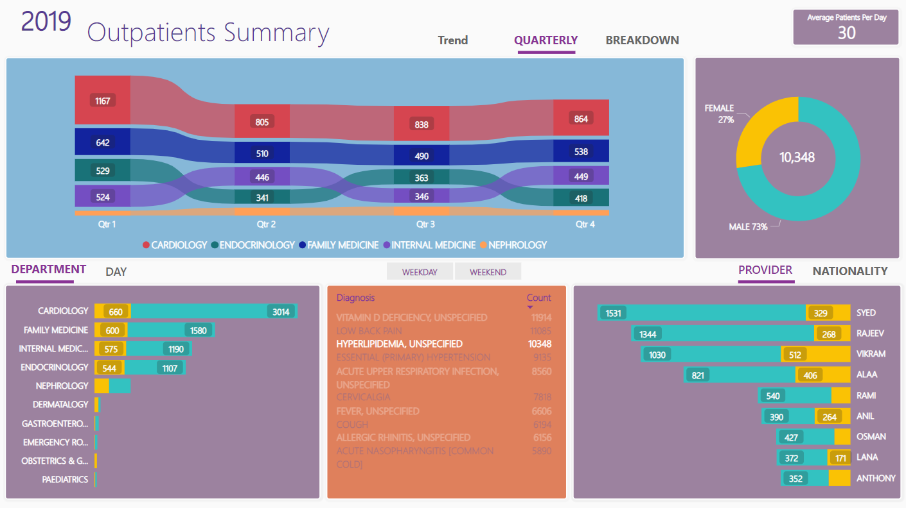
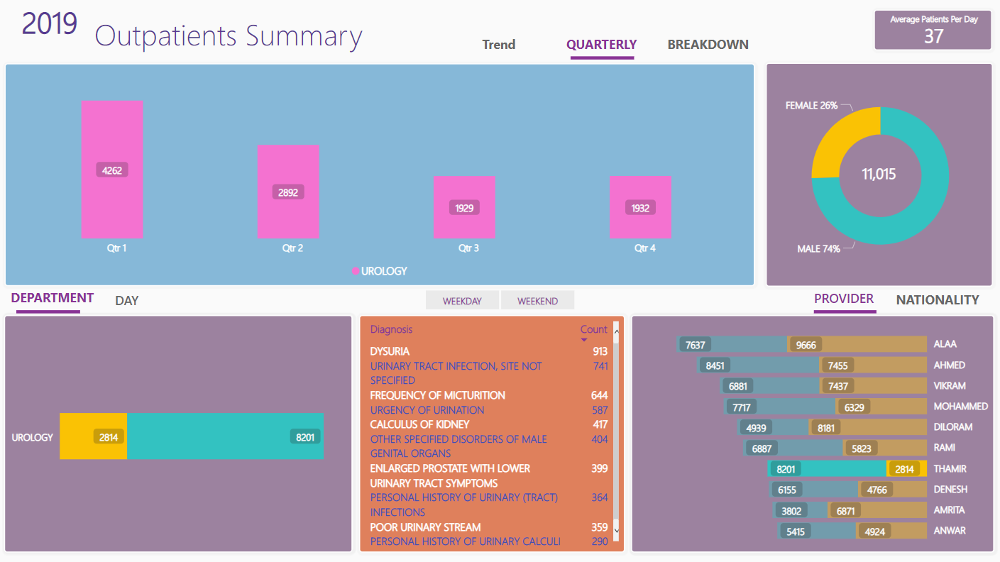

# OutPatientsDashboards

+ This is an example on a set of Dashboards that I created for OutPatients stats and InPatient Stats. 
+ Data has been edited to not reflect reality.
+ These dashboards are Live and their Dataflows and Piplines gets refreshed every 20 mins. 

Please find below Example use case:

Please find below Screenshots for different Slicing and filtering options:

